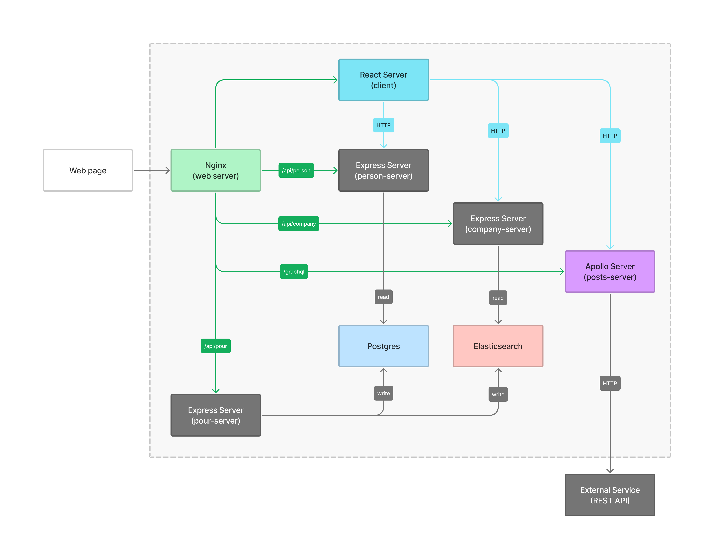

# Ares 

Multi container application consisting of mulitple microservices and 
data sources. 

**Technologies**: Docker, Kubernetes, Helm, Nginx, React, Nodejs, Express, Graphql, Postgres,
Elasticsearch, Logstash, Kibana, and Google Cloud,

* [Overview](#overview)
* [Kubernetes](#kubernetes)
* [Local Development](#local-development)
* [CI/CD](#cicd)
  * [Travis CI](#travis-ci)
* [Deployment](#deployment)
  * [Google Cloud](#google-cloud)

### Overview


#### person-server

#### company-server

#### posts-server

#### pour-server

### Kubernetes

### Local Development
#### Dockerfile
```shell
# Build image 
docker build -t person-server  -f ./person-server/Dockerfile.dev ./person-server

# Run container
docker run -p 5005:5005 person-server
```

#### Docker Compose
```shell
# Start containers
docker-compose up

# Stop containers 
docker-compose down
```

### CI/CD
#### Travis CI

### Deployment
#### Google Cloud
