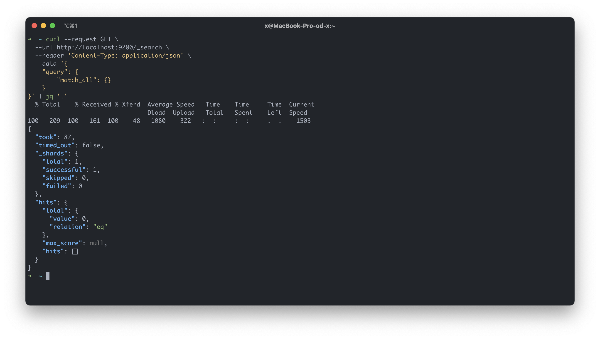

# Ares 

Multi container application consisting of mulitple microservices and 
data sources. 

**Technologies**: Docker, Kubernetes, Helm, Nginx, React, Nodejs, Express, Graphql, Postgres,
MongoDB, Elasticsearch, Logstash, Kibana, and Google Cloud,

* [Overview](#overview)
* [Components](#components)
  * [person-server](#person-server)
  * [company-server](#company-server)
  * [posts-server](#posts-server)
  * [address-server](#address-server)
  * [pour-server](#pour-server)
  * [Elasticsearch](#elasticsearch)
* [Kubernetes](#kubernetes)
* [Local Development](#local-development)
* [CI/CD](#cicd)
  * [Travis CI](#travis-ci)
* [Deployment](#deployment)
  * [Google Cloud](#google-cloud)

### Overview


### Components

#### person-server

#### company-server

#### posts-server

#### pour-server

#### address-server

#### Elasticsearch
Elasticsearch is used to store, search, and manage data for the company-server (express server).

Obtaining Elasticsearch for Docker is as simply as issuing a `docker pull` command 
against the Elastic Docker registry: 
```shell
docker pull docker.elastic.co/elasticsearch/elasticsearch:7.10.2
```
Docker Compose is used to start a multi-node Elasticsearch cluster in Docker. This configuration
provides a simple method of starting a secured cluster for development before building 
a distributed deployment with multiple hosts. 

Communication with Elasticsearch is done through the Index API's which are used to manage individual 
indices, index settings, aliases, mappings, and index templates.
```shell
# Container running 
http://localhost:9200

# Create index
PUT /<index>

# Get index
GET /<target>

# Delete index
DELETE /<index>
```


Elasticsearch provides a full Query DSL (Domain Specific Language) based on JSON to define queries.


### Kubernetes

### Local Development
#### Dockerfile
```shell
# Build image 
docker build -t person-server  -f ./person-server/Dockerfile.dev ./person-server

# Run container
docker run -p 5005:5005 person-server
```

#### Docker Compose
```shell
# Start containers
docker-compose up

# Stop containers 
docker-compose down
```

#### Postgres
Access the Postgres CLI inside the container: 
```shell
# Enter container
docker exec -it postgres /bin/sh

# Postgres CLI
psql --username postgres 

# Commands
$ \c <dbname>   # switch connection to new database
$ \l            # list databases
$ \dt           # list table
$ \d+ <table>   # describe table
```

### CI/CD
#### Travis CI

### Deployment
#### Google Cloud

### Source

* [Express JSON validation](https://simonplend.com/how-to-handle-request-validation-in-your-express-api/)
* [Elasticsearch Index API's](https://www.elastic.co/guide/en/elasticsearch/reference/current/indices.html)
