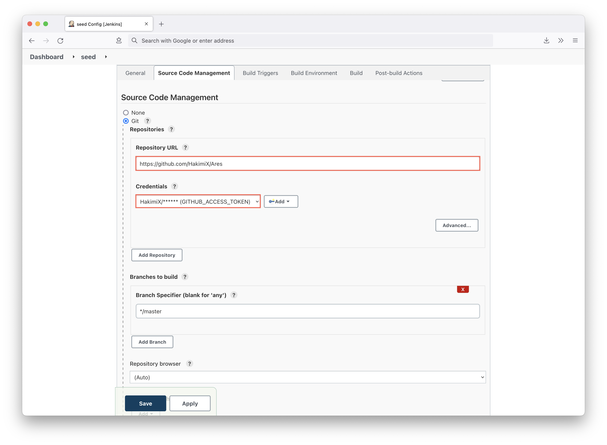
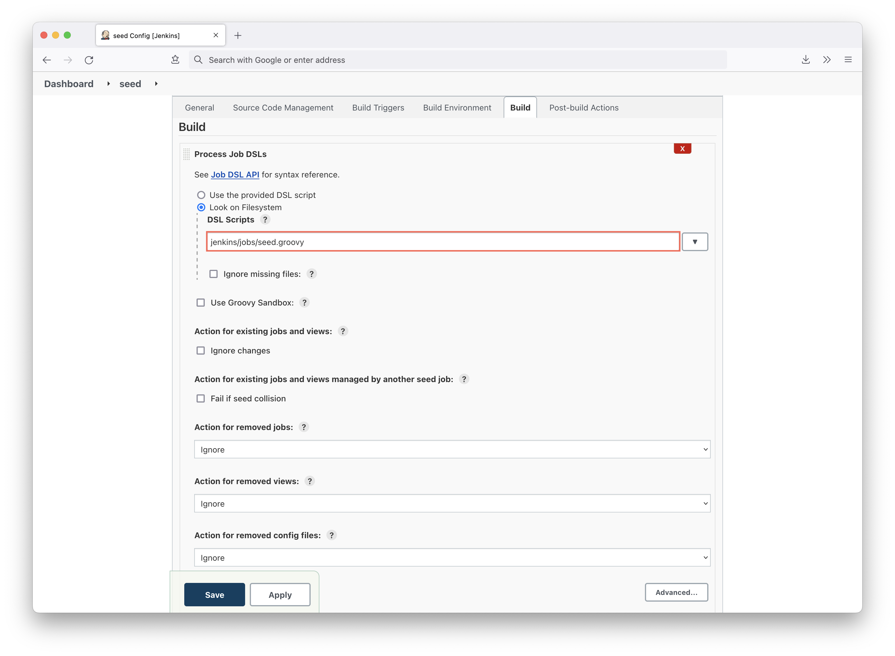
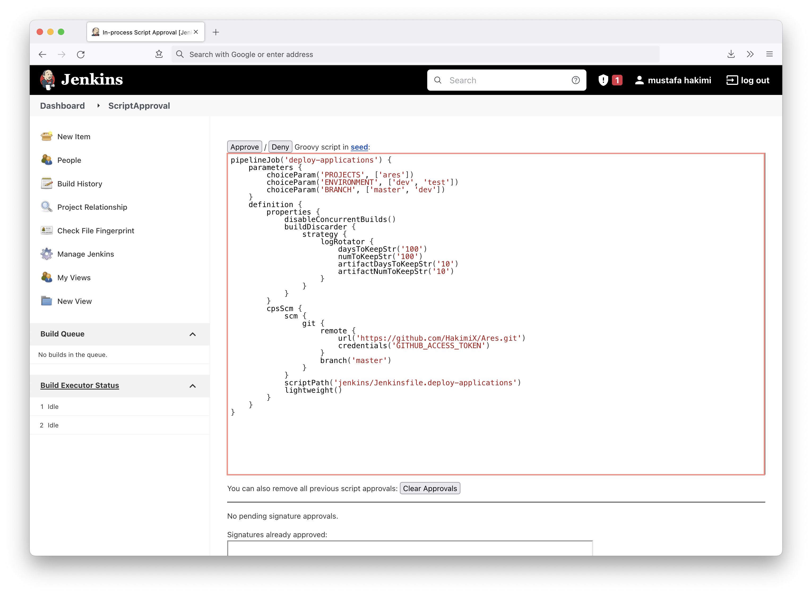
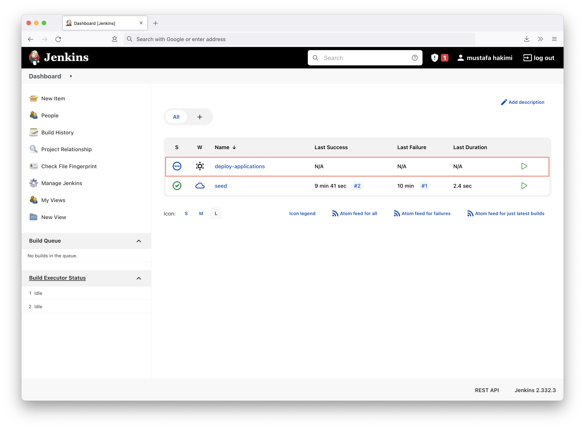
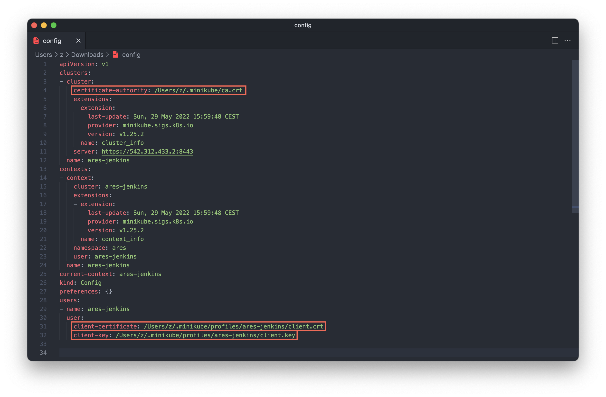
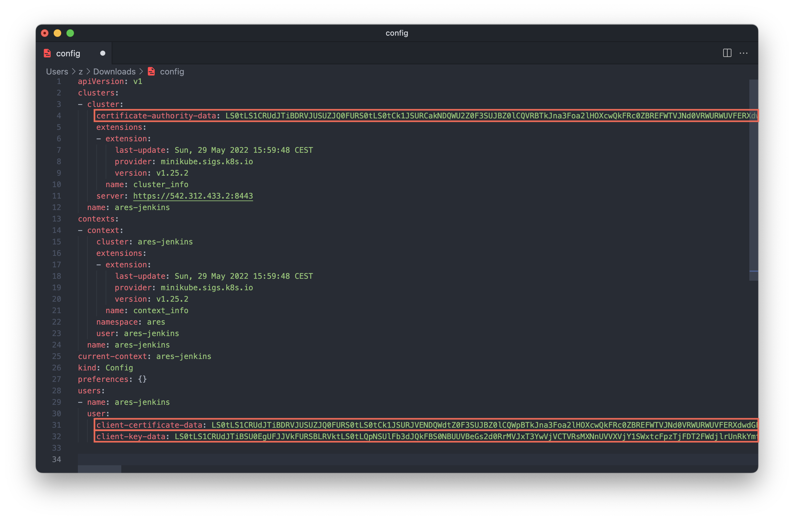
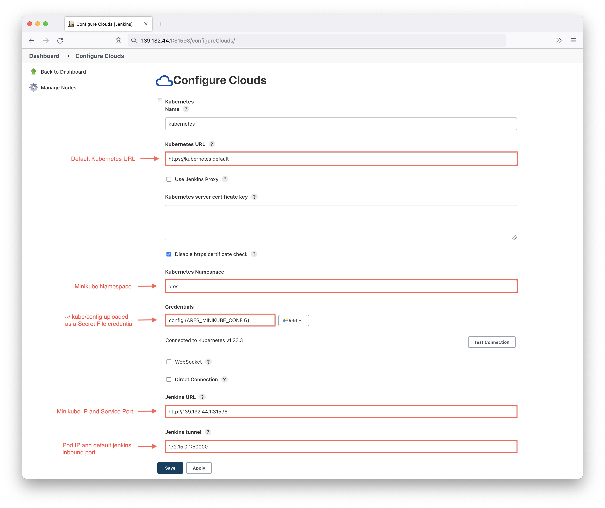

# Jenkins CI/CD on Kubernetes using Minikube

* [Overview](#overview)
* [Setup Jenkins Server](#setup-jenkins-server)
* [Setup Job DSL](#setup-job-dsl)
* [Configure Jenkins and Minikube connectivity](#configure-jenkins-and-minikube-connectivity)
  * [Setup Minikube credential](#setup-minikube-credential)
  * [Create a Cloud Configuration on the Jenkins Controller](#create-a-cloud-configuration-on-the-jenkins-controllergits)
* [Jenkins Plugins](#jenkins-plugins)

### Overview

TODO

### Setup Jenkins Server

1. Create a Minikube profile
```shell
minikube start -p ares-jenkins
```
2. Set as default profile
```shell
minikube profile ares-jenkins
```
3. Create a namespace 
```shell
kubectl create namespace ares
kubens ares
```
4. Deploy Kubernetes manifests
```shell
kubectl apply -f ./kubernetes
```
5. Navigate to Jenkins using the Minikube IP and Service port
```shell
minikube profile list

|------------------|-----------|---------|--------------|------|---------|---------|-------|
|     Profile      | VM Driver | Runtime |      IP      | Port | Version | Status  | Nodes |
|------------------|-----------|---------|--------------|------|---------|---------|-------|
| minikube         | hyperkit  | docker  | 143.138.75.1 | 8443 | v1.23.3 | Stopped |     1 |
| ares-jenkins     | hyperkit  | docker  | 111.622.54.2 | 8443 | v1.23.3 | Running |     1 |
|------------------|-----------|---------|--------------|------|---------|---------|-------|

# Get the service port
kubectl get service 

NAME      TYPE       CLUSTER-IP      EXTERNAL-IP   PORT(S)                                       AGE
jenkins   NodePort   10.110.96.160   <none>        8080:31598/TCP,50000:31919/TCP,80:31840/TCP   3m11s

# Navigate to 
http://111.622.54.2:31598
```
6. Complete the initial Jenkins setup guide and install necessary plugins.<br>
The initial admin user password is outputted in the Jenkins pod logs.
It may also be found at: `/var/jenkins_home/secrets/initialAdminPassword`

### Setup Job DSL
Automate Jenkins job configuration using Job DSL. 

1. Install the Job DSL plugin. 
2. Create a Freestyle Project called `seed` and configure the Souce Code Management and Build Job DSL




You may need to approve the `seed.groovy` script if you encounter the following error:
```shell
Processing DSL script jenkins/jobs/seed.groovy
ERROR: script not yet approved for use
Finished: FAILURE
```
Navigate to Manage Jenkins → In-process Script Approval → Approve



The `deploy-applications` pipeline should automatically be created when the `seed`
pipeline finishes successfully. 



### Configure Jenkins and Minikube connectivity

#### Setup Minikube credential
You'll first need to create a credential set for the Jenkins controller to access the Minikube 
cluster. To do this, perform the following steps: 

1. Replace the certificate references in the `~/.kube/config` file with the actual certificates



Replace each certificate reference with the actual certificate base64 encoded and append 
the yaml keys with `-data`
```shell
# Get certificate content base64 encoded
cat <certificate-file-path> | base64

# Append the keys with "-data"
certificate-authority -> certificate-authority-data
client-certificate -> client-certificate-data
client-key -> client-key-data  
```

The `~/.kube/config` should look like this


The `~/.kube/config` file will be uploaded to Jenkins as a Secret file credential in the next section.

#### Create a Cloud Configuration on the Jenkins Controller
The next step is to create a cloud configuration for the Minikube cluster. 

1. In the Jenkins UI, go to Manage Jenkins → Manage Nodes and Clouds → Configure Clouds
2. The following parameters must be set 



### Jenkins Plugins 

* [Kubernetes](https://plugins.jenkins.io/kubernetes/)
* [Job DSL](https://plugins.jenkins.io/job-dsl/)

### Sources

* [Mount Jenkins credentials](https://stackoverflow.com/questions/65188807/passing-jenkins-secrets-file-to-docker-image-run)
